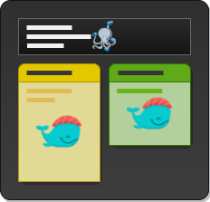
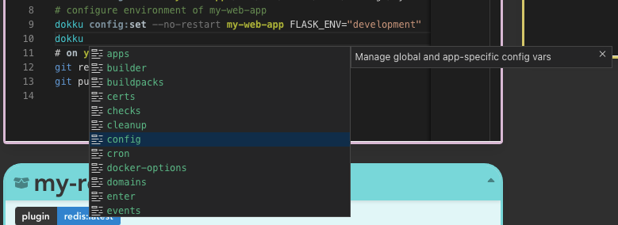

<p align="center">
  
</p>
<p align="center">
Deployed app on <a href="https://dokkupose.netlify.app/" target="_blank">https://dokkupose.netlify.app/</a>
</p>

# Dokkupose

Simple _docker-compose.yml_ to _dokku commands_ web utility written with Vue.js.

Integrated in the application editor for dokku snippets you can find a super simple tokenizer for Monaco (Visual Studio Code editor) that supports first-level auto-completion and syntax highlight for dokku commands.



## Project setup

Install dependencies before launch:

```
yarn install
```

### Compiles and hot-reloads for development

Serve page for local development:

```
yarn serve
```

### Compiles and minifies for production

```
yarn build
```

### Lints and fixes files

```
yarn lint
```
